- [Gui](#Gui)
  - [界面概览](#界面概览)
  - [帮助](#帮助)
  - [设置](#设置)
    - [语言转换](#语言转换)
    - [历史记录](#历史记录)
    - [恢复默认设置](#恢复默认设置)
  - [使用示例](#历史记录)：
    - [Windows下生成compile_commands.json](#生成cmpile_db)
    - [选择输入输出地址](#选择输入输出地址)
    - [自定义设置](#设置)
    - [进行分析](#分析)
  - [异常](#异常)
    - [execution error/执行错误](#执行错误)

## Gui 

### 界面概览

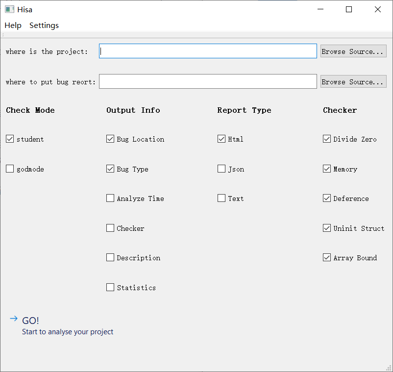

Hisa Gui 版本初始化界面如图所示

- `where is the project`：项目文件夹地址，可以手动输入也可以点击右侧的 `Browse Source...`  按钮进行选择。项目文件中中必须包含 `compile_commands.json` 文件，其生成方式见 `readme.md` → `Linux` → `4`
- `where to put bug report`：分析报告输出地址，有效的文件地址，输入方式同上。
- `Check Mode`：检测模式选项，具体解释见：[帮助](#帮助)
- `Output Info`：输出信息选项，具体解释见：[帮助](#帮助)
- `Report Type`：报告类型选项，具体解释见：[帮助](#帮助)
- `Checker`：检测器选项，具体解释见：[帮助](#帮助)
- `GO!`：检测相关设置自定义后开启检测过程

### 帮助

单击界面左上角的 `Help` 菜单健可以打开 `帮助` 菜单，如下图所示

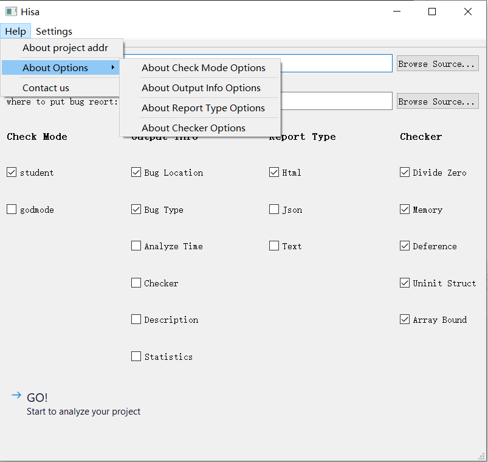

- 单击 `About project addr` 可以查看：`where is the project`对应输入内容的解释信息以及注意事项

- 单击 `About Check Mode Options` ， `About Output Info Options` ， `About Report Type Options` ， `About Checker Options` 可以分别查看：`Check Mode`，`Output Info`，`Report Type`，`Checker`选项的相关i信息，以 `Check Mode` 为例：

  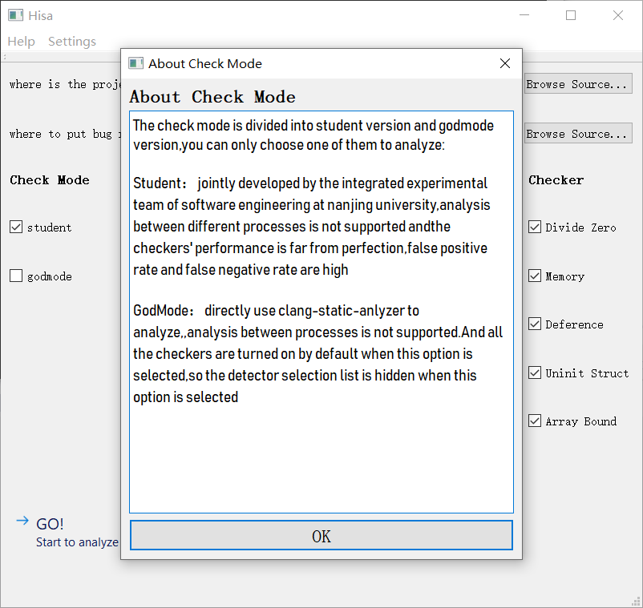

- 单击 `Contact us` 可以查看：官方网站地址与开发者联系方式

### 设置

单击界面右上角的 `Settings` 健可以打开 `设置` 菜单

#### 语言转换

选择 `Settings` 下的 `Language` 子菜单即可进行语言转换，目前仅支持中文(简体)与英文

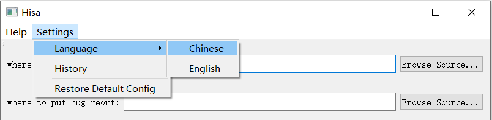

转换为中文后界面如下：

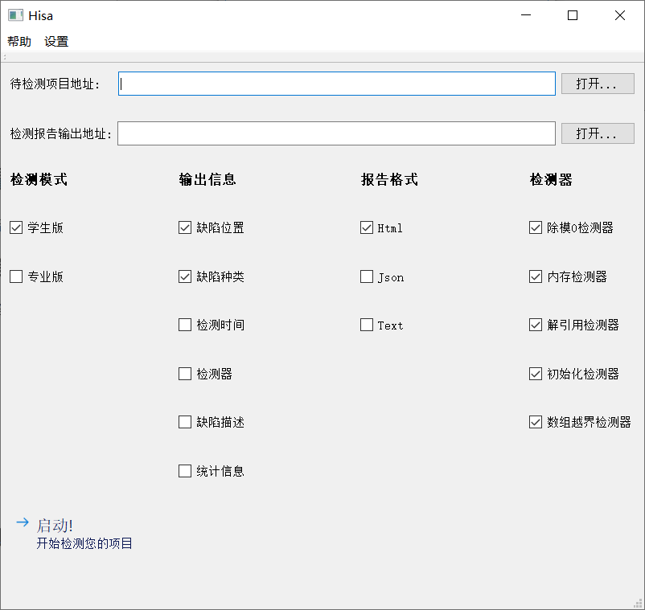

#### 历史记录

选择 `Settings` 下的 `History` 即可查看检测历史记录

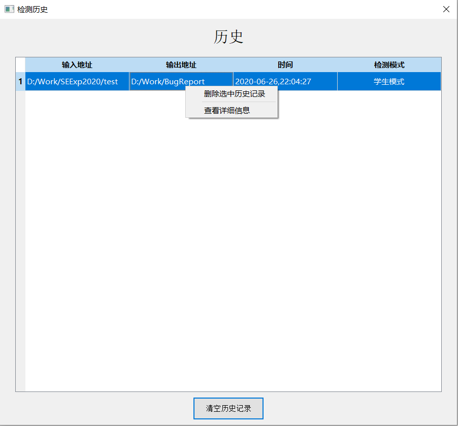

选中记录后 **单击右键** 可以选择删除该条记录 或 查看详细信息

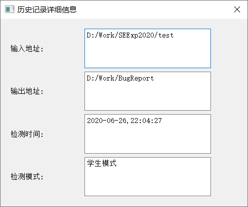

#### 恢复默认设置

将恢复默认的语言设置 (英文) 与 `Check Mode`，`Output Info`，`Report Type`，`Checker` 选项列表的默认选项，如下图所示：

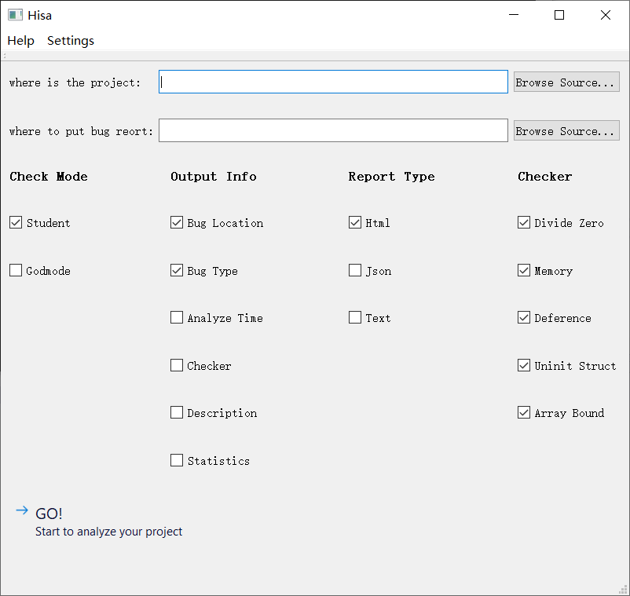

### 使用实例

#### Windows下使用Visual Studio 2019 生成 compile_commands.json文件

首先项目文件夹中需要包含 `CMakeLists.txt`，之后打开VS 2019→ `打开本地文件夹` → `选择项目文件夹`，待加载完成后关闭vs，就可以在项目文件夹下的 `./out/build` 目录下找到 `compile_commands.json` 文件

#### 选择输入输出地址

输入地址选择项目文件夹地址即可，输出地址选择任一合法文件夹即可，这里我们选择`D:\Work\SEExp2020\test`作为项目地址，`D:\Work\BugReport` 作为输出地址

#### 自定义设置

根据需要自行选择  `Check Mode`，`Output Info`，`Report Type`，`Checker` 的相关选项，我们的选择如下所示

#### 进行分析

鼠标点击 `GO!` 按钮进行分析

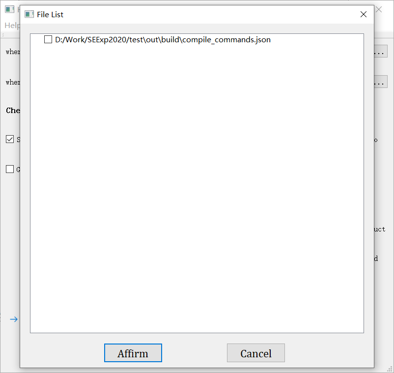

选中生成的 `compile_commands.json` 文件，如果有多个文件，请选择项目所对应的那个

单击 `Affirm` 进入下一步

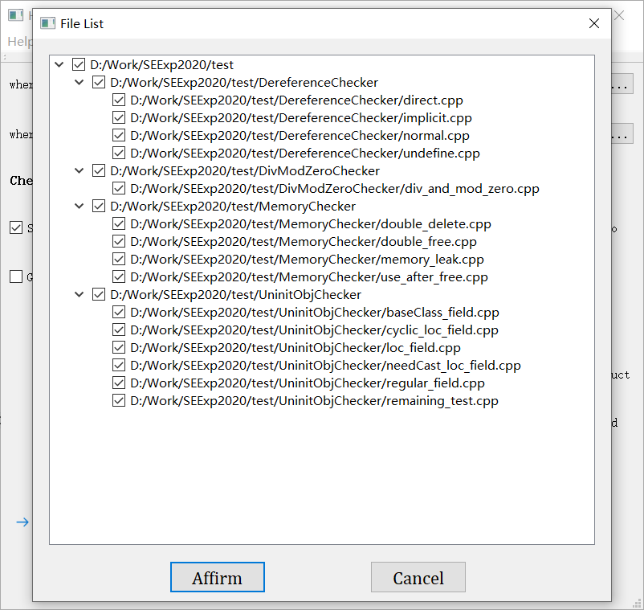

选择项目中需要被检测的文件，默认全选

单击 `Affirm` 进入下一步

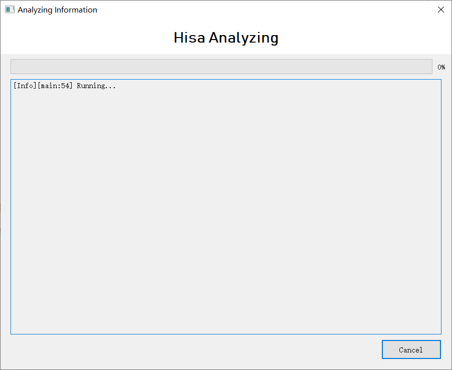

进入分析过程，单击右下角的 `Cancel` 按钮可以取消

分析完成后打开报告输出地址，可以看到我们之前选中的三种类型的报告都已经生成

### 异常

#### 执行错误 

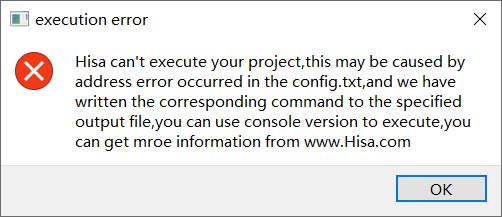

hisa_gui 是基于 console 版本进行的拓展，核心的分析功能是通过调用 hisa_console 完成的。`执行错误` 的发生是由于 hisa_console 被损坏或者被移出安装目录 `hisa/config.txt` 中的路径，可以尝试找将 hisa_console 移回该路径下，或者直接调用该路径下的命令行版本对项目进行分析，如果分析失败，请尝试重新下载。

为了方便用户使用命令行进行分析，当该错误发生后，会自动输出用户自定义选项对应的命令到用户指定的输出文件中。用户只需复制命令至 hisa_console 进行调用即可。

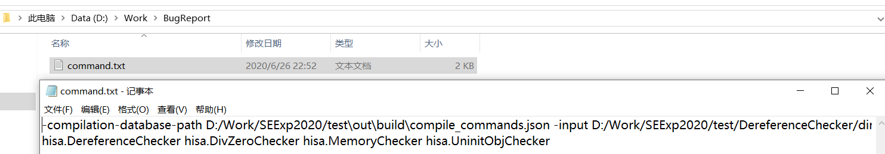

