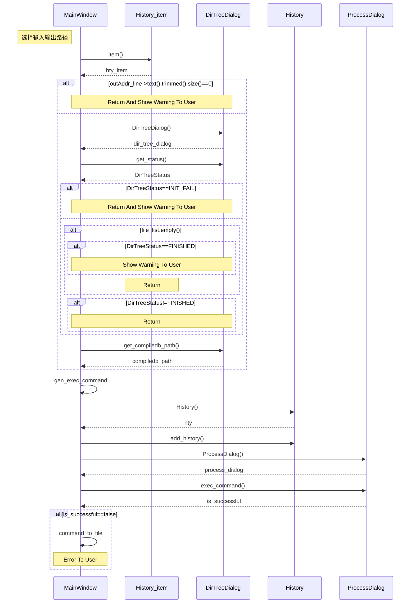

```sequence
Title:Gui 开始分析的过程
participant MainWindow as M
participant History_item as H_i
participant DirTreeDialog as D
participant History as H
participant ProcessDialog as P
Note left of M:用户输入项目文件夹路径\n报告输出路径\n并点击Go!按钮
M->H_i:item()
H_i-->M:
M->D:DirTreeDialog()
D-->M:dir_tree_dialog
M->D:get_status()
D-->M:DirTreeStatus
M->D:get_compiledb_path()
D-->M:compiledb_path
M->H:History()
H-->M:
M->H:add_history()
M->P:ProcessDialog()
P-->M:
M->P:exec_command()
P-->M:is_successful
M->M:command_to_file
```



